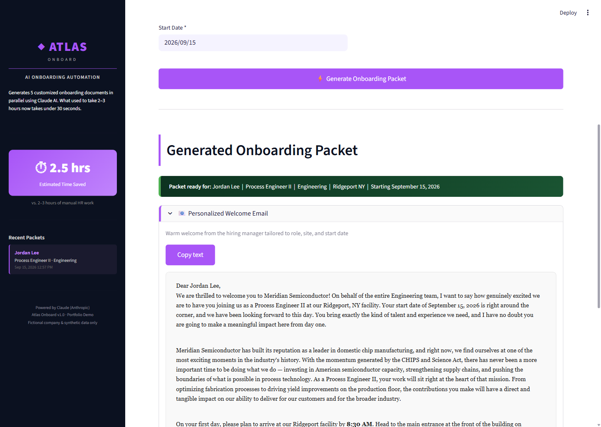

# Atlas Onboard

**From new-hire form to a complete onboarding packet in under 30 seconds.**

Atlas Onboard eliminates one of HR's most repetitive manual tasks: assembling a new-hire onboarding packet. An HR coordinator fills out one form — name, role, department, site, manager, employment type — and Claude generates five fully customized documents **in parallel**: a personalized welcome email, a 30-60-90 day onboarding plan, a site-specific compliance checklist, a first-week schedule, and a confidential manager briefing. All five are compiled into a single branded PDF with one click.

**[Live demo →](#deployment)** &nbsp;·&nbsp; Built with Streamlit, the Claude API, and ReportLab.



## The problem

Preparing a new-hire packet by hand usually means an HR coordinator spending 2–3 hours copy-pasting templates, looking up which compliance rules apply to which site, and customizing documents for role and department. It's repetitive, error-prone, and it's the same five documents every time — just with different facts. That's exactly the shape of task an LLM is good at, if you can generate all five *consistently* from one source of truth and keep the compliance details actually correct per site.

## Use case

The form models a global manufacturing employer — **Meridian Semiconductor**, a fictional company invented for this demo — with sites across the US, Germany, and Singapore. Each site carries different real-world compliance obligations, and the generator adapts automatically:

- **US sites:** ITAR/EAR export-control training and a US-person status check
- **Germany:** GDPR data-privacy training and works-council notification
- **Singapore:** Ministry of Manpower work-pass verification and CPF registration

All five documents are generated by five **concurrent** Claude API calls (`asyncio.gather`), so the whole packet — even with detailed, site-aware compliance checklists — comes back in seconds rather than sequentially.

## How it works

| Step | What happens |
|---|---|
| 1. Form submit | HR coordinator enters the new hire's profile |
| 2. Parallel generation | 5 async Claude calls run concurrently, each with a purpose-built prompt (welcome email, 30-60-90 plan, compliance checklist, first-week schedule, manager briefing) |
| 3. Compile | All 5 documents are rendered into one branded PDF (cover page + sections) with ReportLab |
| 4. Download | HR reviews on-screen, then downloads the PDF to send to the new hire and their manager |

## Running locally

```bash
pip install -r requirements.txt
cp .env.example .env   # then add your ANTHROPIC_API_KEY
streamlit run app.py --server.port 8503
```

Get an API key at [console.anthropic.com](https://console.anthropic.com/).

## Deployment

This is a Python/Streamlit app, so it can't be hosted on GitHub Pages (static files only). It deploys for free on **[Streamlit Community Cloud](https://share.streamlit.io)**:

1. Push this repo to GitHub.
2. Go to [share.streamlit.io](https://share.streamlit.io) → **New app** → select this repo, branch `main`, file `app.py`.
3. Under **Settings → Secrets**, add `ANTHROPIC_API_KEY = "sk-ant-..."`.
4. Deploy — you'll get a public `*.streamlit.app` URL.

## Project structure

```
gf-onboarding/
├── app.py                  # Streamlit UI — form, progress, document display
├── generators.py            # 5 async Claude API calls, gathered in parallel
├── pdf_builder.py            # ReportLab PDF compilation with branded cover page
├── test_generation.py        # Standalone script to test document generation
├── assets/                   # Screenshots used in this README
├── requirements.txt
├── .env.example
└── .streamlit/config.toml    # Theme + server config
```

## Disclaimer

This is a portfolio project. "Meridian Semiconductor" is a fictional company invented to give the demo a realistic scenario. No real employer's confidential information, branding, or trademarks are used, and generated documents are for demonstration only — always have a human review AI-generated HR communications before sending them.

## License

MIT — see [LICENSE](LICENSE).
